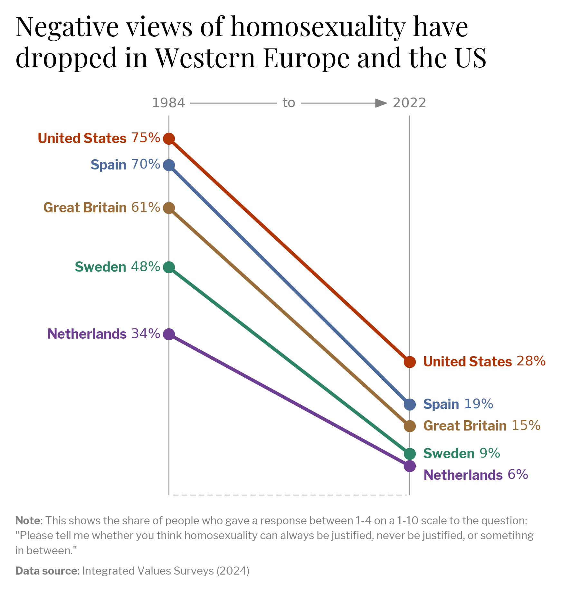
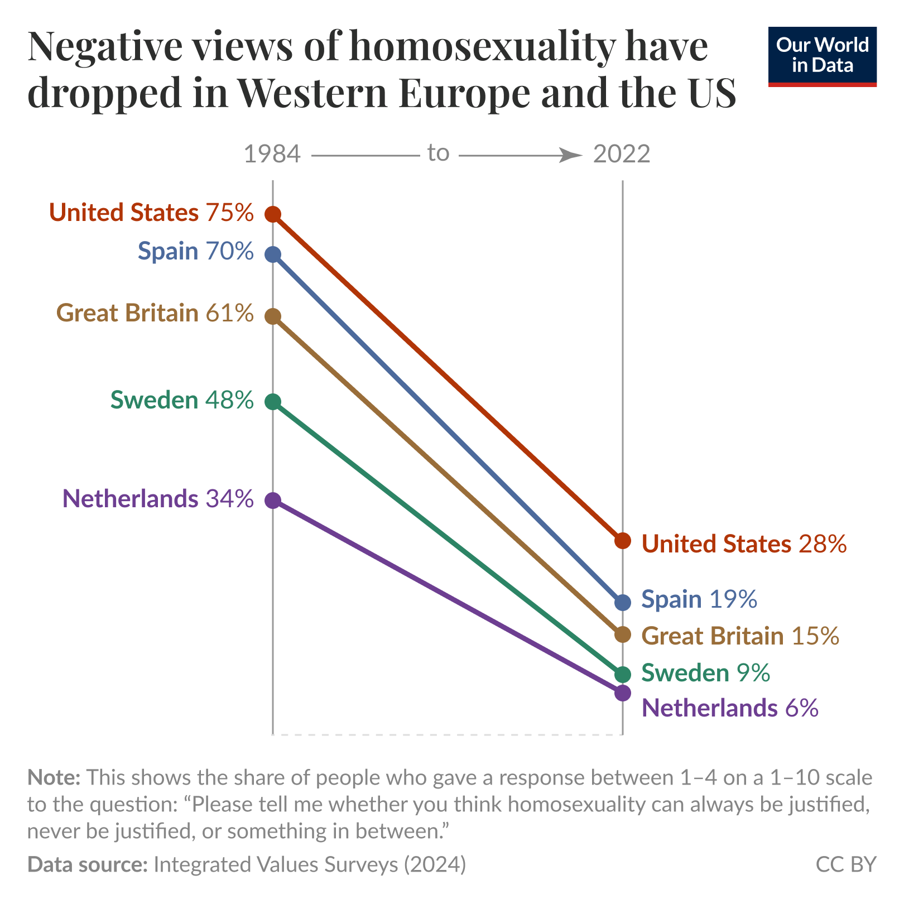

# Viz recreation: Public views about homosexuality

This project recreates an **Our World in Data** visualization showing the decline of homophobic attitudes in Western Europe and the United States over the past four decades.  
It is intended as a hands-on exercise in data visualization and chart reproduction using Python.

---

## 📊 Visualisation

**Recreated chart:**  

**Original chart (Our World in Data):**  

---

The dataset and original chart come from [Our World in Data](https://ourworldindata.org/), and all credit for the data and original design belongs to them.  

---

## 📂 How to explore

To dive into the details of how the chart was recreated, open the Jupyter Notebook file:
[homophobia_decline_viz.ipynb](homophobia_decline_viz.ipynb)
